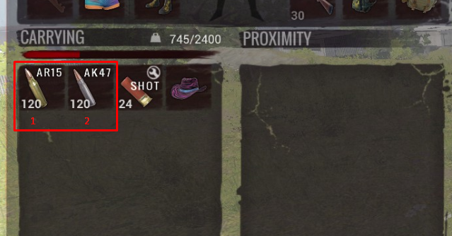

# h1z1-autoinventory
AutoHotkey Script to automatically use inventory slots in H1Z1

[](https://www.paypal.com/cgi-bin/webscr?cmd=_s-xclick&hosted_button_id=L7JBYXFVHM4XL)

## Just press a key and you will automatically use inventory slots


**NOTE: It only works with inventory on left!**

## Settings

```
;Set the Invetory hotkey you use in H1Z1
InventoryKey = {Tab}
;Set hotkey to use slot number 1
SlotOneKey = b
;Set hotkey to use slot number 2
SlotTwoKey = n
;Set your in-game resolution
Resolution := [1280,1050]

;In case script isn't clicking the slots, you can give your custom coordinates here.
;Just delete uncomment and give x and y values

;SlotOneCoordinates := [x,y]
;SlotTwoCoordinates := [x,y]

H1Z1_ahk_exe = H1Z1.exe ;Name of h1z1 exe so it script will only work inside it
DelayTime = 5 ;Delay time to execute script in milliseconds
```
